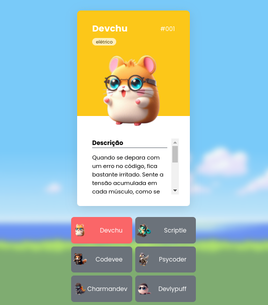

  

  

## 🖥️ Projeto
Esse é um projeto web Responsivo para selecionar e exibir personagens desenvolvedores "PokeDevs".

## 🚀 Tecnologias
Esse projeto foi desenvolvido durante o evento DZPC do Dev em Dobro com as seguintes tecnologias: 

- HTML
- CSS
- JS
- Git e Github